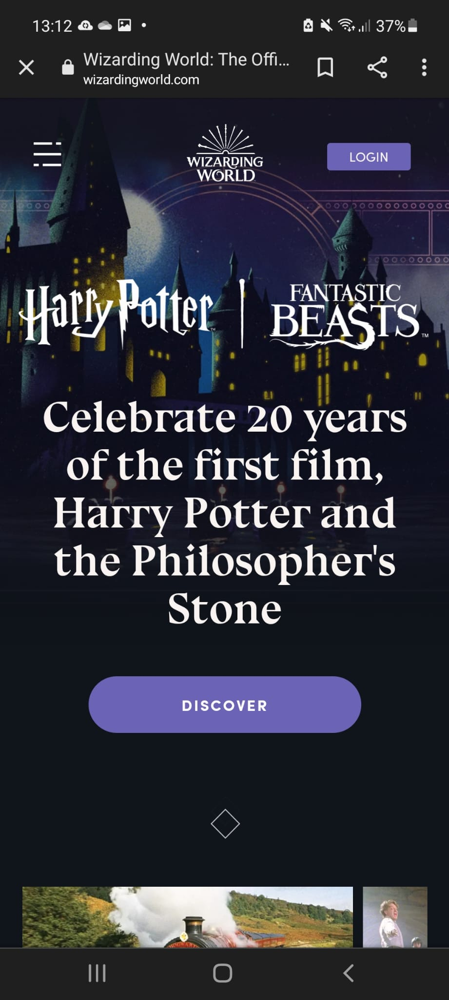
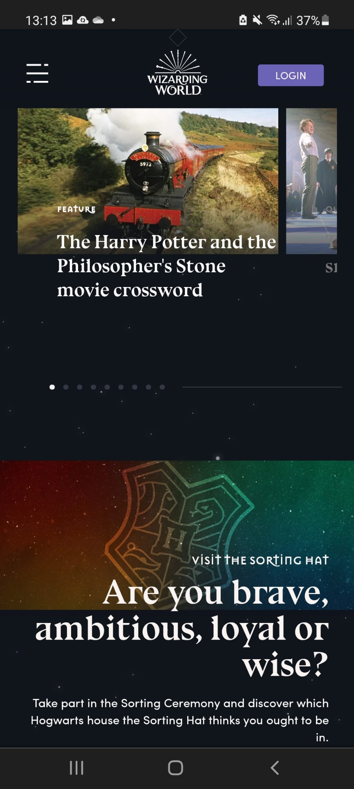
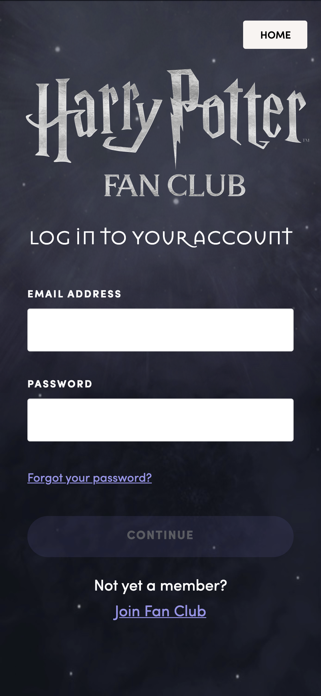
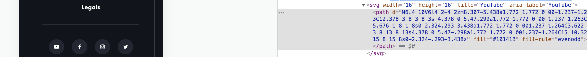
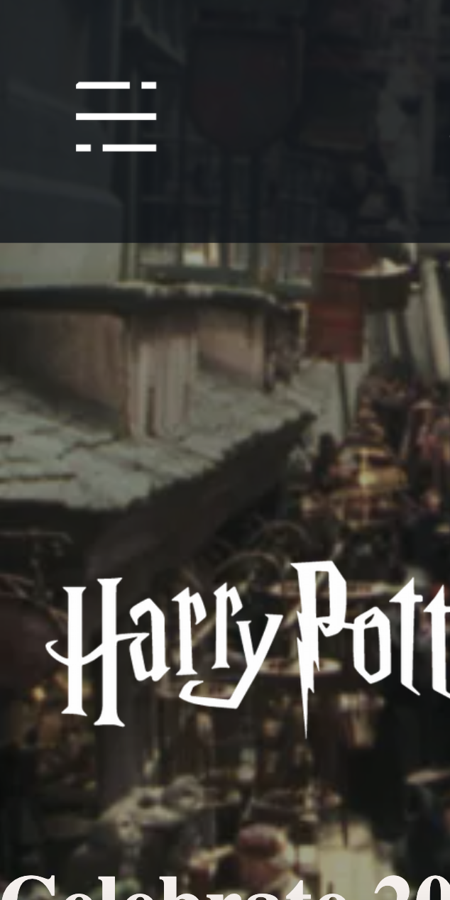
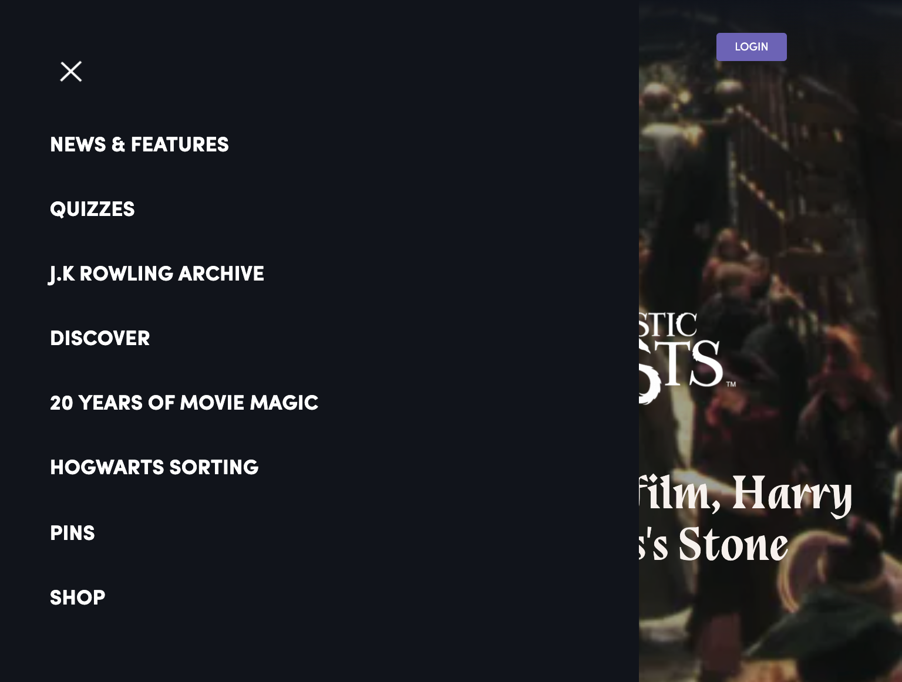

# Procesverslag
Markdown is een simpele manier om HTML te schrijven.  
Markdown cheat cheet: [Hulp bij het schrijven van Markdown](https://github.com/adam-p/markdown-here/wiki/Markdown-Cheatsheet).

Nb. De standaardstructuur en de spartaanse opmaak van de README.md zijn helemaal prima. Het gaat om de inhoud van je procesverslag. Besteedt de tijd voor pracht en praal aan je website.

Nb. Door *open* toe te voegen aan een *details* element kun je deze standaard open zetten. Fijn om dat steeds voor de relevante stuk(ken) te doen.

## Jij

Wie ben ik en wat ga ik doen.

### Auteur:
Eva Zaadnoordijk

#### Je startniveau:
Rood

#### Je focus:
Helemaal responsive
 

## Je website

voor kick-off werkgroep

### Je opdracht:
Ik ga de website van https://www.wizardingworld.com/ namaken.

#### Screenshot(s) van de eerste pagina (small screen): 
Homepage

#### Screenshot(s) van de tweede pagina (small screen):
Inlogpage

 

## Breakdownschets (week 1)

na afloop 2e werkgroep

### de hele pagina: 

### dynamisch deel (bijv menu): 

### wellicht nog een dynamisch deel (bijv filter): 

## Voortgang 1 (week 2)

voor 1e voortgang

### Stand van zaken
hier dit ging goed & dit was lastig (neem ook screenshots op van delen van je website en code)
Ik heb alle html voor mijn website al zo goed als af. Aan CSS moet ik nog beginnen. Het enige wat niet is
gelukt is de buttons voor sociale media toe te voegen dit zijn namelijk path's.

Ook moet ik nog een animatie invoegen.
<video src="imagaes/">
Tot slot moet ik van mijn NAV nog een hamburgermenu maken, maar dit ga ik eerst nog zelf uitzoeken.

### Verslag van meeting
Wat moet er anders...

- Gebruik comments in je code. Die had ik nog niet.
- Van de socialbuttons op mijn website svg of abeeldingen opzoeken geen path gebruiken.
- De animatie op mijn website hoeft niet, als ik tijd over heb is het wel leuk.

## Voortgang 2 (week 3)

voor 2e voortgang

### Stand van zaken
hier dit ging goed & dit was lastig (neem ook screenshots op van delen van je website en code)
Het maken van mijn hamburger menu ging goed, deze staat er in. Ook de header is af en werkt naar behoren.

Deze week had ik een probleem met de grootte van mijn website. Nadat ik mijn hamburger-menu had gemaakt en ik weer terugging naar mijn homepage, was mijn website heel erg ver ingezoomd. Dit heb ik uiteindelijk opgelost door mijn afbeeldingen kleiner te maken, deze vielen namelijk buiten de html. Ik heb hierdoor ook de header moeten resizen.

### Verslag van meeting
Wat moet er anders...

- De "h" aanpassen op mijn website. Ik heb namelijk meerdere h1 en dat mag niet, ook komen er h4 voor mijn h2 en dat kan niet.
- Mijn lettertypes laden niet in als ik mijn site op github zet dus maak ik van "http" een "https".
- Ik gebruik in mijn site zowel pixels als em voor grootte. Hier ga ik 1 van de 2 van maken, dit staat wat netter.
- Om mijn links als echte links te laten gedragen voeg ik daar aan een "href="#"" toe.

## Toegankelijkheidstest (week 4)

na test in 4e voortgang

### Bevindingen
Lijst met je bevindingen die in de test naar voren kwamen:
- Het contrast van mijn website is goed. Alles is leesbaar doordat bijna alles ook zwart op wit is. Dit heb ik kunnen checken met de contrast "checker tool" deze hgeeft een groen vinkje als deze juist is.
- Als je door een gele bril kijkt wordt de kleur paars dus grijs. Alles is nog steeds goed leesbaar.
- Alles in caps worrdt uitgespeld met een screenreader. 
- Er staan losse opsommingstekens in mijn website blijkbaar.
- Voor mensen met motorieke problemen is mijn website ook prima bruikbaar door de grote knoppen.

#### Caps
##### Korte omschrijving
Toen ik een screenreader over mijn website haalde, ben ik er achter gekomen dat alle headings en tekst die ik met all caps had geschreven, deze letter voor letter werden uitgespeld. Voor blinde mensen kan dit voor veel verwarring zorgen.

##### Oplossing
De oplossing die ik hiervoor gevonden heb is om alle heading die in caps waren geschreven weer terug te zetten naar normale tekst. Om in css vervolgens deze een text-transform: uppercase; te geven. 

#### Losse opsommingstekens
##### Korte omschrijving
Toen ik een screenreader over mijn website haalde ben ik er ook achter gekomen dat er losse opsommingstekens op mijn website stonden. Deze waren zwart en door mijn donkere achtergrond-kleur had ik ze in eerste instantie niet gezien.

##### Oplossing
Ik ben nog eens goed gaan kijken naar mijn html en ben er achter gekomen dat ik deze inderdaad hier met een doel had neergezet, namelijk om knoppen neer te zetten voor de afbeeldingsslider. Ik heb deze ul uiteindelijk verwijderd.

## Voortgang 3 (week 4)

voor 3e voortgang

### Stand van zaken
Het lukte mij niet om de afbeelding boven aan de pagina goed te sizen. Ik wil graag dat de afbeelding altijd in de gehele breedte van het scherm zichtbaar is. Maar als ik dat doe dan is afbeelding geheel vervormt op desktop. Ik heb dit geprobeerd op te lossen "met overflow-y" maar dit lukte niet.

### Verslag van meeting
Wat moet er anders...

- Alles ziet er goed uit, zorg ervoor dat je je 2e pagina optijd af hebt.
- Werk je procesverslag bij
- Oplossing voor plaatje: "object-fit: cover/contain".

## Eindgesprek (week 5)

voor eindgesprek

### Stand van zaken
hier dit ging goed & dit was lastig (neem ook screenshots op van delen van je website en code)
Ik zat te twijfelen over hoe ik mijn form zou inrichten in verband met de toegangkelijkheid hiervan. Of een screenreader ze wel juist zo voorlezen. Ik heb dankzij Watson, L. (2016) ervoor gekozen om toch mijn form van een legend en fieldset te voorzien.

Ik krijg de "view all features" knop niet onderaan in de section door middel van grid. Uiteindelijk heb ik dit wel kunnen oplossen door het element in mijn css anders aan te spreken.
### Screenshot(s)
Het eindresultaat!!!

## Bronnenlijst

De bronnen die ik gebruikt (mij hebben geolpen) tijden het maken van mijn website

Nb. Wees specifiek ('css-tricks' als bron is bijv. niet specifiek genoeg).

1. Croak, M. (2020, 30 november). How to Change the Color of an Image With CSS - Better Programming. Better Programming. https://betterprogramming.pubhow-to-change-the-color-of-an-image-with-css-83664f6527ac
2. Fonts: 1. https://www.dafontfree.net/bluu-next-bold/f167978.htm
          2. https://www.cdnfonts.com/sofia-pro.font
          3. https://use.typekit.net/est4vhd.css

3. Watson, L. (2016, 22 juli). Using the fieldset and legend elements. Accessibility in Government. https://accessibility.blog.gov.uk/2016/07/22/using-the-fieldset-and-legend-elements/
4. Afbeeldingen: Wizarding World. (z.d.). Wizarding World: The Official Home of Harry Potter. Wizarding World: The Official Home of Harry Potter. Geraadpleegd op 5 oktober 2021, van https://www.wizardingworld.com/

